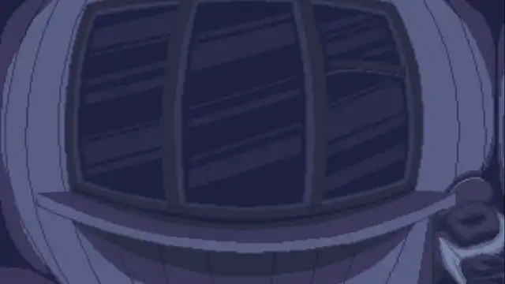

# renpy-panorama
Пример реализации (не самой эффективной) интерактивной прокрутки экрана / панорамы в RenPy.  
Используется специальный слой, на котором можно размещать разные объекты и использовать переходы.

Для демонстрации использовались:
* Иллюстрации - [ELilit](https://vk.com/elilit)
* Звуки - [fresound.org](https://freesound.org)

Код был изначально написан для [данной игры](https://sena-180.itch.io/delicious)

================

Позже добавил варианты искажения изображения (объекты вблизи границ экрана растягиваются по высоте) с использованием шейдеров.

